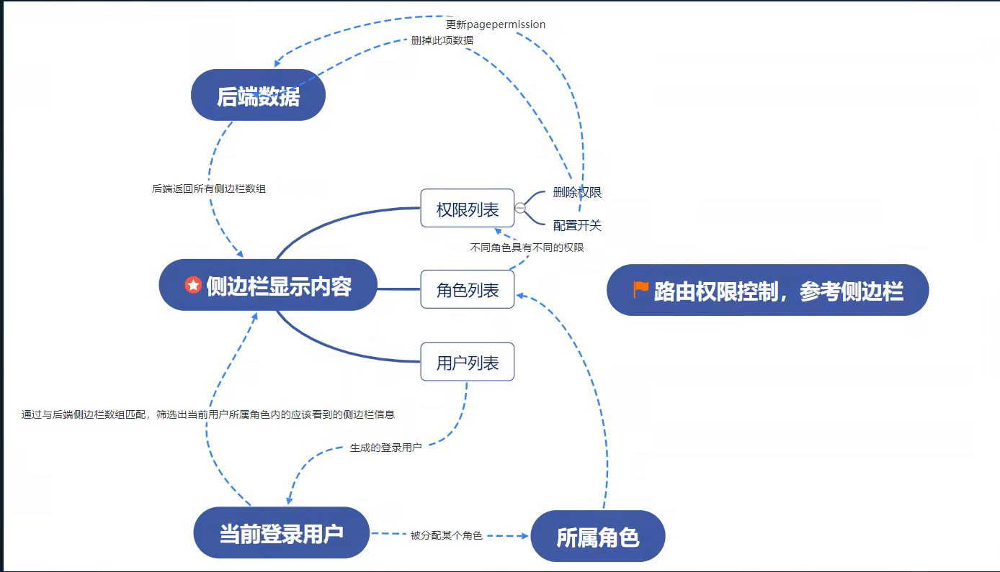

### sass模块(css -->  scss)
    安装 `npm i --save sass`
### 配置反向代理
    安装axios `npm i --save axios`
    安装反向代理 `npm i --save http-proxy-middleware`
    ```
        const { createProxyMiddleware } = require("http-proxy-middleware") // 更改引入方式

        module.exports = function (app) {
            app.use(
                createProxyMiddleware('/news',{// 遇到api1前缀的请求，就会触发该代理配置
                    target: 'http://localhost:5000',// 请求转发给谁
                    changeOrigin:true,// 控制服务器收到的请求头中Host字段的值
                    pathRewrite:{'^/news':''}
                }),
                // proxy('/api1', { //遇见/api1前缀的请求，就会触发该代理配置
                //     target: 'http://localhost:5000', //请求转发给谁
                //     changeOrigin: true,//控制服务器收到的请求头中Host的值
                //     pathRewrite: { '^/api1': '' } //重写请求路径(必须)
                // }),
                createProxyMiddleware('/api', {
                    target: 'http://localhost:5001',
                    changeOrigin: true,
                    pathRewrite: { '^/api': '' }
                }),
            )
        }
    ```
    在src下面添加文件setupProxy.js，并重启服务器加载配置文件！
### 系统路由

安装路由：`npm i --save react-router-dom`
[中文文档]https://ant.design/index-cn
<Menu/>、<Table/>、<Sider/>、<Layout/>、<Content/>、<TopHeader/>组件的使用

### 引入antd
安装antd：`npm i --save antd`

### 权限控制


